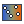
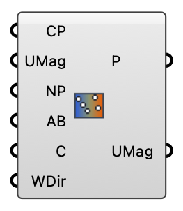

##  Interpolate UMag

Resample per-direction wind-magnitude fields onto a new point grid (nearest-neighbour average, with per-direction rotation). Prepares grids for GAN applications.

#### Input
* ##### CP 
Source points, one branch per direction.
* ##### UMag 
Source wind magnitudes, one branch per direction.
* ##### NP 
Target points to resample onto.
* ##### AB 
Number of nearest source points to average.
* ##### C 
Rotation center.
* ##### WDir 
Wind direction (deg) per branch.

#### Output
* ##### P
The new points.
* ##### UMag
Resampled wind magnitudes, one branch per direction.