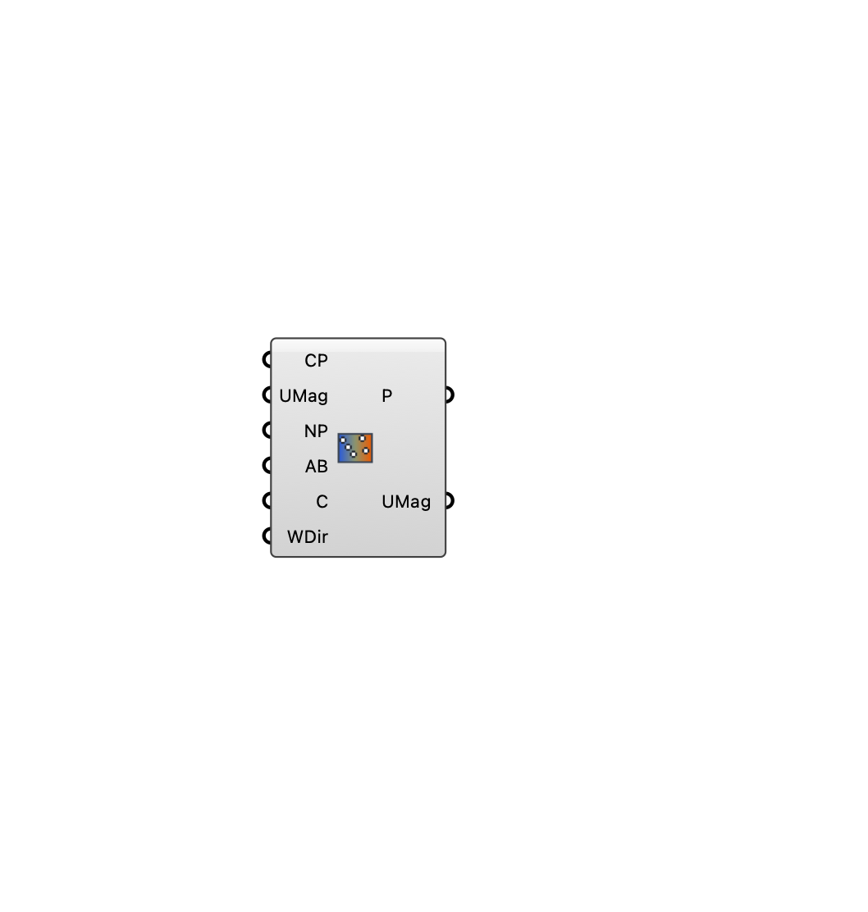

#  Interpolate UMag - [[source code]](https://github.com/Eddy3D-Dev/Eddy3D/search?q=%22Interpolate%20UMag%22)

Resample per-direction wind-magnitude fields onto a new point grid (nearest-neighbour average, with per-direction rotation). Prepares grids for GAN applications.

#### Input
* ##### Current Points (CP) 
Source points, one branch per direction.
* ##### UMag 
Source wind magnitudes, one branch per direction.
* ##### New Points (NP) 
Target points to resample onto.
* ##### Average By (AB) 
Number of nearest source points to average.
* ##### Center Point (C) 
Rotation center.
* ##### WDir 
Wind direction (deg) per branch.

#### Output
* ##### Points (P)
The new points.
* ##### UMag
Resampled wind magnitudes, one branch per direction.