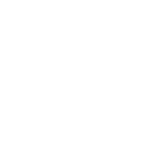

##  [[source code]](https://github.com/Eddy3D-Dev/Eddy3D/search?q=%22Live%20Residuals%22)

Draws a wind case's residual convergence directly on the Grasshopper canvas, with lightweight timed updates. Wire the case and toggle 'Live' to monitor a running simulation without an external plotter window. When a warm-up ramp is enabled the solver restarts mid-run and writes a separate residual file per phase; all phases are stitched into one continuous curve so you see the full history (warm-up + main), not just the latest phase.

#### Input
* ##### Case 
Wind case (from the wind case component or Load Wind Case).
* ##### Live 
Set to true to enable timed live updates.

#### Output
* ##### File (F)
Residuals file being monitored.