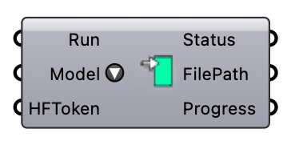

##  ML Model

Download an ONNX wind-prediction model from HuggingFace for the Wind Predictor component. Yel 2.0 is public; Esen 1.0 and Poyraz 1.0 need a HuggingFace token. All are 8-channel Wind Predictor models. (Yel 1.0 is a different architecture — the GAN image model used by GAN Predict via its API — and cannot be loaded here.) Models cache in ~/SUS_LAB/ and are reused on subsequent runs.  Version 1.0.0.827

#### Input
* ##### Run 
Set to True to validate the token and download the model if needed.
* ##### Model 
Select the ONNX model to download.
* ##### HFToken 
HuggingFace access token (starts with hf_) or a file path to a .txt file containing the token. Required for private models (Esen, Poyraz). Not required for public models (Yel).

#### Output
* ##### Status
Human-readable status / diagnostic message.
* ##### FilePath
Full path to the cached ONNX model file, or null on failure.
* ##### Progress
Download progress percentage (0–100).