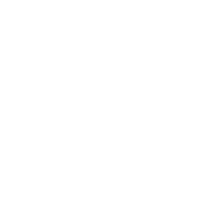

##  [[source code]](https://github.com/Eddy3D-Dev/Eddy3D/search?q=%22MRT%22)

Compute mean radiant temperature at the sensors. Direct-raycast shortwave by default; wire MRT Settings with reflections/diffuse radiation on to use the Radiance DDS engine.

#### Input
* ##### Surfaces (S) 
Tagged radiation surfaces (MRT Surface).
* ##### Sensors (P) 
Sensor probes (MRT Sensors).
* ##### EPW (W) 
Path to the EPW weather file.
* ##### Settings (C) 
MRT settings (optional).
* ##### Dir 
Working directory for the Radiance DDS run (used only when reflections/diffuse radiation is enabled).
* ##### Run (R) 
Run the MRT analysis.
* ##### Engine 
Run Radiance/EnergyPlus natively or via the bundled radiance-energyplus Docker image. Only relevant when MRT Settings enables Radiance Reflections or EnergyPlus Surfaces.

#### Output
* ##### Points (P)
Sensor positions.
* ##### MRT (M)
Annual hourly MRT per sensor {probe}(8760).
* ##### Sky Dome (D)
The generated sky dome (preview).
* ##### Probes (X)
Solved probes (for UTCI component).