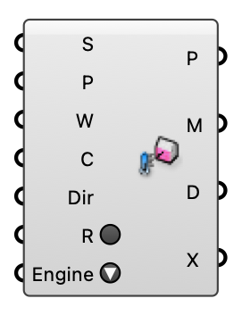

##  MRT

Compute mean radiant temperature at the sensors. Direct-raycast shortwave by default; wire MRT Settings with reflections/diffuse radiation on to use the Radiance DDS engine.  Version 1.0.0.827

#### Input
* ##### S 
Tagged radiation surfaces (MRT Surface).
* ##### P 
Sensor probes (MRT Sensors).
* ##### W 
Path to the EPW weather file.
* ##### C 
MRT settings (optional).
* ##### Dir 
Working directory for the Radiance DDS run (used only when reflections/diffuse radiation is enabled).
* ##### R 
Run the MRT analysis.
* ##### Engine 
Run Radiance/EnergyPlus natively or via the bundled radiance-energyplus Docker image. Only relevant when MRT Settings enables Radiance Reflections or EnergyPlus Surfaces.

#### Output
* ##### P
Sensor positions.
* ##### M
Annual hourly MRT per sensor {probe}(8760).
* ##### D
The generated sky dome (preview).
* ##### X
Solved probes (for UTCI component).