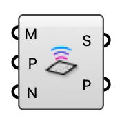

##  MRT Sensors

Create comfort sensor probes from a mesh (face centers) or points.

#### Input
* ##### M 
Sensor mesh; one probe per face center.
* ##### P 
Explicit sensor points (used if no mesh).
* ##### N 
Sensor normal for point input (default world Z).

#### Output
* ##### S
Sensor probes for the MRT component.
* ##### P
Sensor positions (preview).