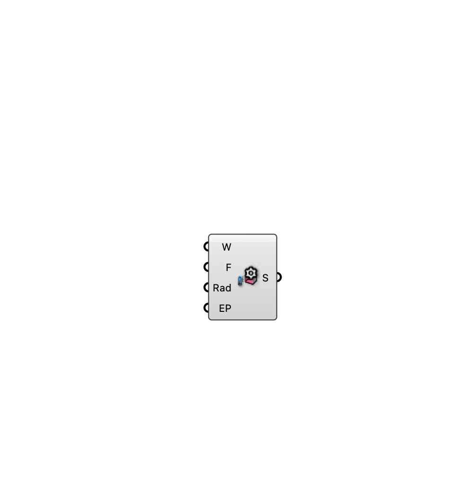

##  [[source code]](https://github.com/Eddy3D-Dev/Eddy3D/search?q=%22MRT%20Settings%22)

Configuration for the MRT + UTCI analysis.

#### Input
* ##### Wind Scaling (W) 
Factor applied to weather wind speed when a probe has no CFD wind.
* ##### Small Face Cutoff (F) 
Faces below this area (m²) are ignored by the thermal model.
* ##### Rad 
High-fidelity shortwave via the Radiance DDS chain (true) vs the pure-C# raycast (false). Requires a Radiance install (or Use Docker).
* ##### EnergyPlus Surfaces (EP) 
Surface temperatures from EnergyPlus (true) vs ambient (false). Requires an EnergyPlus install (or the Docker engine on the MRT component).

#### Output
* ##### Settings (S)
MRT settings for the MRT component.