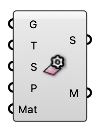

##  MRT Surface

Mesh Breps into a tagged radiation surface for an MRT analysis.

#### Input
* ##### G 
Surface geometry to mesh.
* ##### T 
Surface type: 0 Building, 1 Ground, 2 Vegetation, 3 Tree.
* ##### S 
True if the surface temperature is solved; false treats it as ambient.
* ##### P 
Target mesh patch edge length (m) for view-factor resolution.
* ##### Mat 
Optional material from a Surface / Vegetation / Tree Settings component; overrides the default reflectance / Radiance material for this surface.

#### Output
* ##### S
Tagged radiation surface for the MRT component.
* ##### M
The meshed surface (preview).