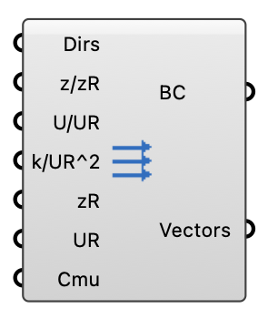

#  Manual Inflow Profile - [[source code]](https://github.com/Eddy3D-Dev/Eddy3D/search?q=%22Manual%20Inflow%20Profile%22)

Define inflow boundary conditions from a manually entered vertical profile (z/zR, U/UR, k/UR^2) instead of the parametric ABL log-law. Writes fixedProfile inlet conditions for U, k and epsilon. epsilon is derived from the profile as epsilon(z) = Cmu^0.5 * k(z) * d(U)/dz.

#### Input
* ##### Dirs 
Wind directions as meteorological degrees (wind-from, clockwise from north, e.g. 0, 45, 90) or flow vectors. One solver case is created per direction; the profile magnitudes are rotated to each direction. Optional; default is flow toward +X.
* ##### z/zR 
List of normalized heights z/zR (z = height above ground, zR = boundary layer height).
* ##### U/UR 
List of normalized streamwise velocities U/UR at each height (UR = reference velocity at zR).
* ##### k/UR^2 
List of normalized turbulent kinetic energies k/UR^2 at each height.
* ##### zR 
Boundary layer height zR (m), used to de-normalize z/zR. Optional; default is 250.
* ##### Reference Velocity (UR) (UR) 
Reference velocity UR at zR (m/s), used to de-normalize U/UR and k/UR^2. Optional; default is 7.8.
* ##### Cmu 
Turbulence model constant Cmu used to derive epsilon from the profile. Optional; default is 0.09.

#### Output
* ##### Boundary Conditions (BC)
Manual-profile inflow boundary conditions (single direction); plug into the wind case BC input.
* ##### Vectors
Resolved unit flow vector for the inflow direction.