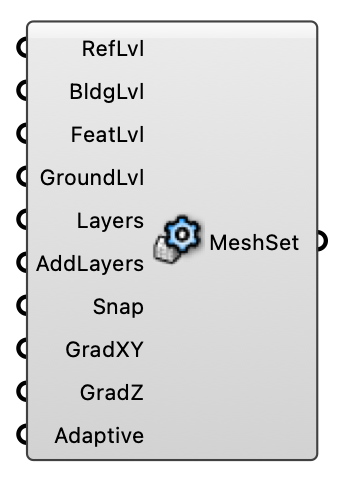

##  Mesh Settings

Configure mesh refinement, layers, and grading for Eddy3D.

#### Input
* ##### RefLvl 
Refinement level inside the refinement box (higher is finer). Optional; default is 2.
* ##### BldgLvl 
Refinement level for building surfaces. Optional; default is 2.
* ##### FeatLvl 
Refinement level for building edges and corners. Optional; default is 2.
* ##### GroundLvl 
Refinement level for ground/terrain surfaces. Optional; default is 2.
* ##### Layers 
Number of prism layers to add. Optional; default is 4.
* ##### AddLayers 
Enable prism layer addition. Optional; default is false.
* ##### Snap 
Snap the castellated mesh to the input geometry surfaces. Default is true (snapping on).
* ##### GradXY 
Adaptive grading strength in X/Y: 1 = uniform, up to 10 = cells concentrate hard over the building and coarsen toward the domain edges.
* ##### GradZ 
Adaptive grading strength in Z: 1 = uniform, up to 10 = cells concentrate over the building height and coarsen aloft.
* ##### Adaptive 
Enable adaptive grading near buildings. Optional; default is true.

#### Output
* ##### MeshSet
Mesh settings for snappyHexMesh and blockMesh.