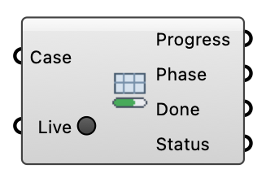

##  Meshing Progress

Monitor blockMesh, surfaceFeatures, and snappyHexMesh progress from the mesh case logs.  Version 1.0.0.827

#### Input
* ##### Case 
Wind case (from the wind case component or Load Wind Case).
* ##### Live 
Set to true to re-read the meshing logs once a second — no external timer needed.

#### Output
* ##### Progress
Estimated meshing progress from 0 to 1.
* ##### Phase
Current meshing phase.
* ##### Done
True when meshing has finished.
* ##### Status
Status text (errors, remaining time).