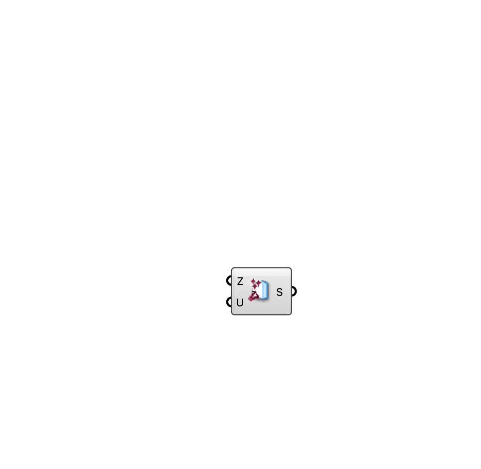

##  [[source code]](https://github.com/Eddy3D-Dev/Eddy3D/search?q=%22Momentum%20Source%22)

A fan/jet momentum source (mean velocity) box for an indoor ventilation case.

#### Input
* ##### Zone (Z) 
Box zone occupied by the source.
* ##### Mean Velocity (U) 
Target mean velocity in the zone (m/s).

#### Output
* ##### Source (S)
Momentum source for the Indoor Case component.