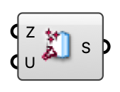

##  Momentum Source

A fan/jet momentum source (mean velocity) box for an indoor ventilation case.

#### Input
* ##### Z 
Box zone occupied by the source.
* ##### U 
Target mean velocity in the zone (m/s).

#### Output
* ##### S
Momentum source for the Indoor Case component.