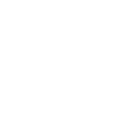

##  [[source code]](https://github.com/Eddy3D-Dev/Eddy3D/search?q=%22OpenFOAM%20Dictionary%22)

Create an OpenFOAM dictionary for file modification inputs.

#### Input
* ##### Keys 
Keys to store in the OpenFOAM dictionary.
* ##### Values 
Values to store in the OpenFOAM dictionary.

#### Output
* ##### Dict
Created dictionary object.