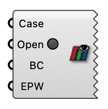

##  Open In ParaView

Open a wind case's direction cases in ParaView. All directions are added to the ParaView pipeline browser; click Apply on the ones you want to load (nothing is loaded automatically).  Version 1.0.0.827

#### Input
* ##### Case 
Wind case (from the wind case component or Load Wind Case).
* ##### Open 
Set to true to launch ParaView with all direction cases.
* ##### BC 
ABL or Uniform Flow boundary conditions (provides simulated directions, reference speeds, z0, zRef). Required for comfort analysis.
* ##### EPW 
Path to an EPW weather file. When provided together with BC, the ParaView script computes pedestrian wind comfort at 1.5 m.

#### Output