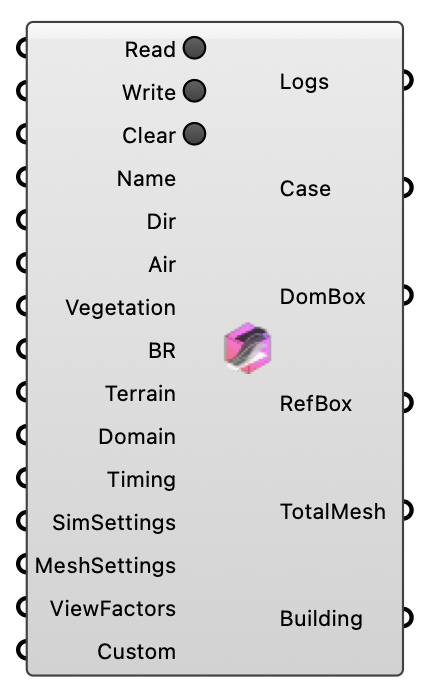

##  Outdoor+ Case

Create, read, and manage an Outdoor+ (UMF microclimate) case. OutdoorPlus  Version 1.0.0.827

#### Input
* ##### Read 
Read an existing case from the working directory.
* ##### Write 
Write the case files to the working directory.
* ##### Clear 
Delete all files for this case in the working directory.
* ##### Name 
Case folder name (no spaces).
* ##### Dir 
Folder for case files and results.
* ##### Air 
Air region for this case.
* ##### Vegetation 
Vegetation region for this case.
* ##### BR 
Building region of this case
* ##### Terrain 
Terrain region for this simulation (optional).
* ##### Domain 
Domain and refinement box parameters.
* ##### Timing 
Case timing settings.
* ##### SimSettings 
Simulation control settings.
* ##### MeshSettings 
Simulation mesh settings.
* ##### ViewFactors 
View factor settings.
* ##### Custom 
Optional additional entries to merge into the case.

#### Output
* ##### Logs
Case modification logs.
* ##### Case
UMF case instance.
* ##### DomBox
Resolved simulation domain box.
* ##### RefBox
Refinement box derived from the case.
* ##### TotalMesh
Total mesh for the case.
* ##### Building
Building mesh.