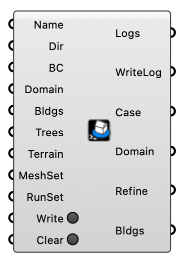

##  Outdoor Case

Create, write, and manage an Eddy3D outdoor wind simulation case.  Version 1.0.0.827

#### Input
* ##### Name 
Case folder name (no spaces). Optional — if left blank, a friendly random name is generated automatically (e.g. swift-otter-fjord-lantern).
* ##### Dir 
Folder for case files and results (default: %USERPROFILE%/Eddy3D/Outdoor).
* ##### BC 
Boundary conditions from the ABL or Uniform Flow component, carrying the wind directions (required for Write Case).
* ##### Domain 
Domain parameters from the Box Domain or Cylinder Domain component (box with auto extents when empty).
* ##### Bldgs 
Closed building meshes (required for Write Case).
* ##### Trees 
Tree canopy meshes or Tree porous-zone objects from the Tree component (optional).
* ##### Terrain 
Terrain mesh (optional).
* ##### MeshSet 
Mesh settings from the Mesh Settings component.
* ##### RunSet 
Run settings from the Run Settings component.
* ##### Write 
Write the case files to the working directory.
* ##### Clear 
Delete all files for this case in the working directory.

#### Output
* ##### Logs
Case modification logs.
* ##### WriteLog
WriteCase logs formatted for component input.
* ##### Case
Wind case; plug into the Wind Run and post-processing components.
* ##### Domain
Resolved simulation domain (box, or domain mesh for cylindrical cases).
* ##### Refine
Refinement box derived from the case.
* ##### Bldgs
Building meshes from the case.