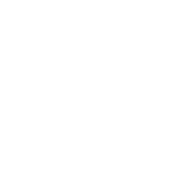

#  Parse Case Logs - [[source code]](https://github.com/Eddy3D-Dev/Eddy3D/search?q=%22Parse%20Case%20Logs%22)

Parses log files in a case folder and reports any FOAM errors. OutdoorPlus

#### Input
* ##### Case 
Case to parse logs from.
* ##### Run 
Parse log files when true. Optional; default is false.

#### Output
* ##### Summary
Summary of log parsing results.
* ##### Errors
Errors found in log files.
* ##### Warnings
Warnings found in log files.