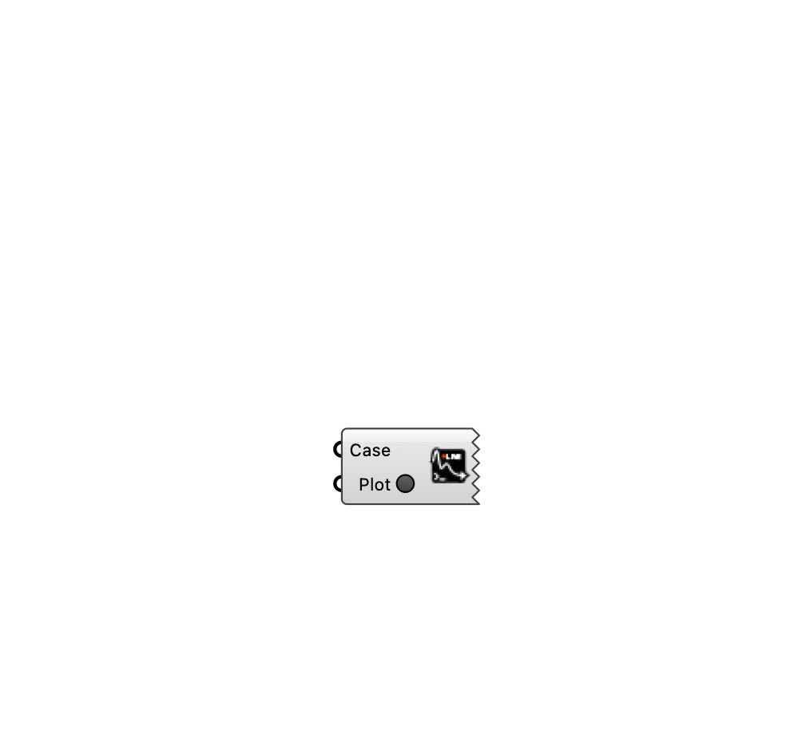

##  [[source code]](https://github.com/Eddy3D-Dev/Eddy3D/search?q=%22Plot%20Residuals%22)

Open the web-based residual plotter for a wind case's convergence history (one trace per direction).

#### Input
* ##### Case 
Wind case (from the wind case component or Load Wind Case).
* ##### Plot 
Set to true to open the residual plotter in your browser.

#### Output