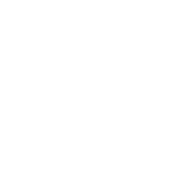

#  Probe - [[source code]](https://github.com/Eddy3D-Dev/Eddy3D/search?q=%22Probe%22)

Sample fields at points on a solved case, post-hoc. With Run it writes a probes function and runs postProcess on the latest time, then reads the results; without Run it reads existing results. Works on a wind case (one sub-result per direction) or a loaded case.

#### Input
* ##### Case 
What to probe: a solved case (wind / loaded / UMF / indoor), or a FluidX3D VTK directory (the VTK Dir output of FluidX3D Run). The component adapts to the input automatically.
* ##### Pts 
Probe points in model space. Required when Run is true.
* ##### Field 
Field to sample, from the dropdown of common OpenFOAM fields (U, p, k, epsilon, …). Type or wire any other field name for a custom quantity. For a FluidX3D VTK directory: "rho"/"density" → density, otherwise velocity.
* ##### Region 
Region to probe; leave empty for single-region (wind) cases.
* ##### Name 
Name of the probe set. Optional; default is 'probes'.
* ##### Run 
True: run postProcess to sample the latest time, then read. False: read existing results only.

#### Output
* ##### Values
Probe values (numbers or vectors); branch = {sub-result, field, time}, items = one per point.
* ##### Times
Sampled time steps; branch = {sub-result, field}.
* ##### Subs
Sub-result labels matching the first branch index (e.g. wind direction case names).