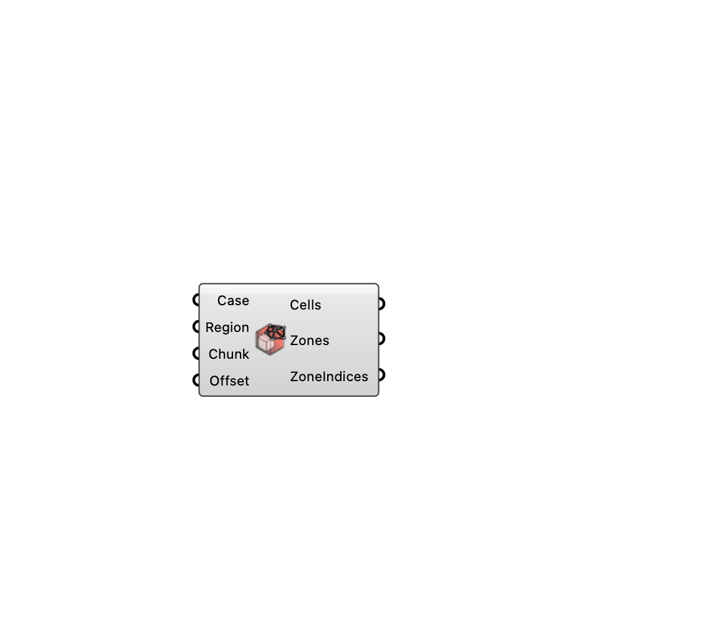

##  [[source code]](https://github.com/Eddy3D-Dev/Eddy3D/search?q=%22Read%20Cells%22)

Read cell connectivity and cell zones for a region. OutdoorPlus

#### Input
* ##### Case 
UMF case containing the region data.
* ##### Region 
Region name to read.
* ##### Chunk 
Chunk size for reading owner/neighbour files. Optional; default is 500.
* ##### Offset 
Chunk offset for reading owner/neighbour files. Optional; default is 0.

#### Output
* ##### Cells
Tree of cells containing face indices.
* ##### Zones
Cell zone names.
* ##### ZoneIndices
Indices for each cell zone.