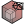
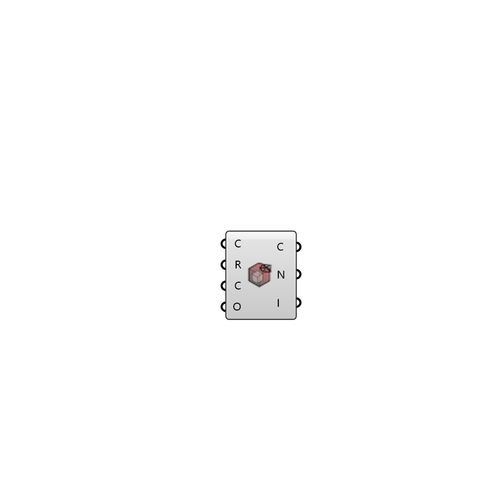

##  Read Cells - [[source code]](https://github.com/Eddy3D-Dev/Eddy3D-UMCF/blob/release/UMCF/CMP/Visualization/ReadCellsCMP.cs)

Cells from owner and neighbour files. CellZones from cellZones file if existing

#### Input
* ##### C
UMCF Case class to extract the working directory
* ##### R
UMCF Case region to visualize
* ##### C
Chunk size for reading the owner and neighbour files
* ##### O
Chunk offset for reading the owner and neighbour files

#### Output
* ##### C
List of cells containing a list of indices pointing to mesh faces
* ##### N
List of cell zone names
* ##### I
List of indices for each cell zone