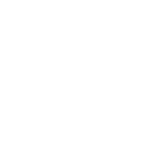

##  [[source code]](https://github.com/Eddy3D-Dev/Eddy3D/search?q=%22Read%20OpenFOAM%20Case%22)

Read an OpenFOAM case directory and list its file containers.

#### Input
* ##### Dir 
Directory containing the OpenFOAM case.

#### Output
* ##### Files
File containers found in the case.
* ##### Ignored Files (I)
Names of files in the directory that were not added to the case.