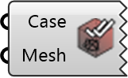

##  Read checkMesh

Read and visualize sets produced by checkMesh. OutdoorPlus

#### Input
* ##### Case 
UMF case containing checkMesh set files.
* ##### Mesh 
UMF mesh data used to extract faces and points.

#### Output