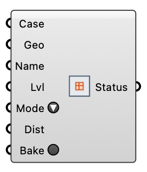

#  Refinement Region - [[source code]](https://github.com/Eddy3D-Dev/Eddy3D/search?q=%22Refinement%20Region%22)

Add a custom snappyHexMesh refinement region (a box, solid or surface) to a written case's mesh, then re-mesh. Refines the cells inside/near the geometry to the chosen level.

#### Input
* ##### Case 
The written wind case whose mesh should gain the refinement region.
* ##### Geo 
The region geometry: a Box/closed Brep/Mesh (use mode inside/outside) or an open surface (use mode distance). Written as an STL into the mesh case.
* ##### Name 
Region key (a valid OpenFOAM word, e.g. "towerWake").
* ##### Lvl 
snappyHexMesh refinement level inside/near the region (e.g. 2). Default 2.
* ##### Mode 
inside (refine the whole closed region), outside (refine everything outside it), or distance (refine within Distance metres of the surface). Default inside.
* ##### Dist 
For distance mode: refinement band width in metres. Default 10.
* ##### Bake 
Write the region STL and snappyHexMeshDict entries into the mesh case (idempotent), then re-run meshing. Momentary button.

#### Output
* ##### Status
What was baked, and into how many mesh cases.