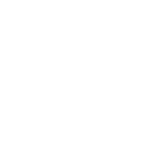

#  Relative Humidity - [[source code]](https://github.com/Eddy3D-Dev/Eddy3D/search?q=%22Relative%20Humidity%22)

Convert specific humidity (w) and temperature (T) to relative humidity (%). OutdoorPlus

#### Input
* ##### w 
Specific humidity in kg/kg (from OpenFOAM field 'w').
* ##### Temperature (T) 
Air temperature in Kelvin (from OpenFOAM field 'T').
* ##### Pressure (P) 
Atmospheric pressure in Pa. Optional; default is 101325 Pa.

#### Output
* ##### Relative Humidity (RH)
Relative humidity in percent (0–100%).