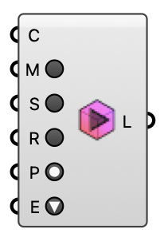

#  Run - [[source code]](https://github.com/Eddy3D-Dev/Eddy3D/search?q=%22Run%22)

Mesh and run an OpenFOAM case on the selected engine (wind / indoor / UMF).

#### Input
* ##### Case (C) 
An OpenFOAM case to run (wind study, indoor case, or UMF case).
* ##### Mesh (M) 
Mesh only.
* ##### Simulate (S) 
Simulation only.
* ##### Run All (R) 
Mesh, then run the simulation.
* ##### Parallel (P) 
Run in parallel (decompose / MPI).
* ##### Engine (E) 
OpenFOAM execution engine.

#### Output
* ##### Logs (L)
Run logs.