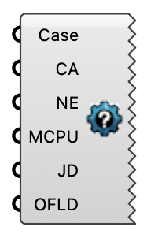

#  SLURM Runner - [[source code]](https://github.com/Eddy3D-Dev/Eddy3D/search?q=%22SLURM%20Runner%22)

Write SLURM batch (sbatch) files to run a wind study on an HPC cluster.

#### Input
* ##### Case 
The wind study to generate cluster job files for.
* ##### Charge Account (CA) 
SLURM charge account.
* ##### Notification Email (NE) 
SLURM notification email.
* ##### MCPU 
RAM per CPU in GB, e.g. 10 for 10G.
* ##### Job duration (JD) 
Duration of the SLURM job in hours.
* ##### OFLD 
Cluster module-load command for OpenFOAM.

#### Output