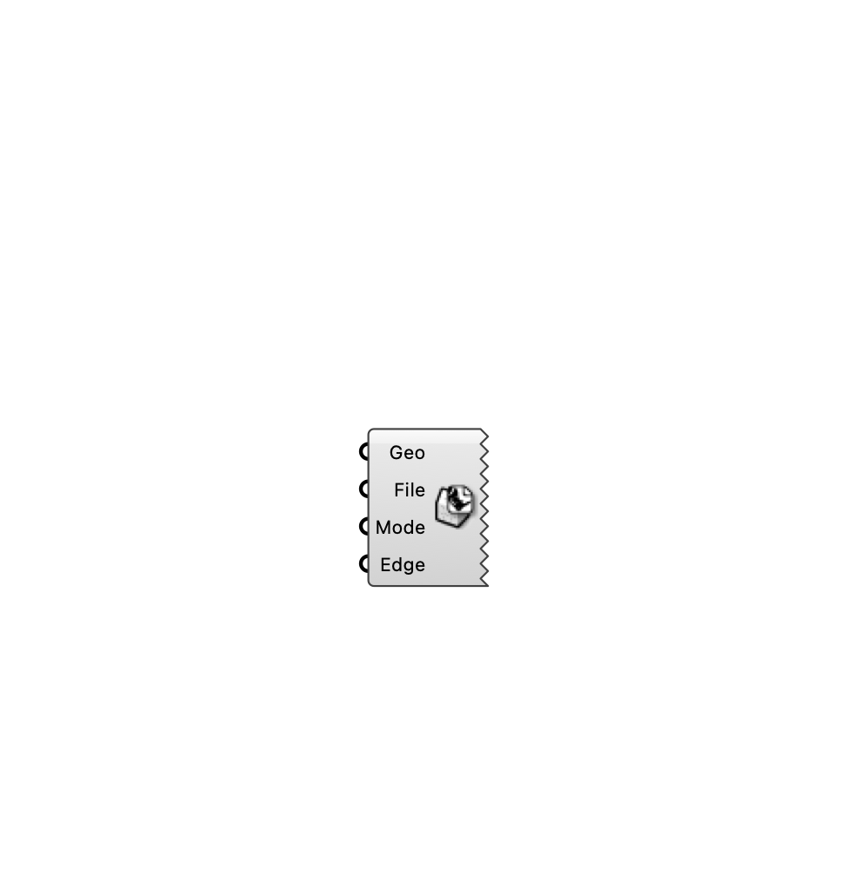

#  [[source code]](https://github.com/Eddy3D-Dev/Eddy3D/search?q=%22STL%20Exporter%22)

Export geometry to STL format for OpenFOAM or other CFD tools. Supports meshes and Breps (auto-meshed); binary or ASCII, single or multiple files.

#### Input
* ##### Geo 
Meshes or Breps to export.
* ##### File 
Destination file path (.stl).
* ##### Mode 
Export mode: 0=Binary, 1=ASCII, 2=Binary (multi-file), 3=ASCII (multi-file).
* ##### Edge 
Optional: maximum edge length for auto-meshing Breps (m). 0 = default meshing.

#### Output