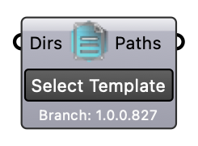

#  Select Template - [[source code]](https://github.com/Eddy3D-Dev/Eddy3D/search?q=%22Select%20Template%22)

Load example Grasshopper definitions for common workflows.
 
 Templates include microclimate simulations, outdoor comfort studies,
 and CFD analysis setups.
 
 Version: 1.0.0.827

#### Input
* ##### Dirs 
Optional: Additional folder paths or GitHub URLs to search for .gh/.ghx templates. Example URL: https://github.com/Startraders/Eddy3D-Templates/tree/main/Outdoor

#### Output
* ##### Paths
Full paths to discovered template files (.gh/.ghx)