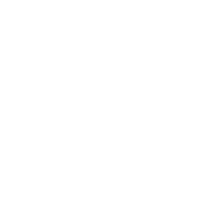

#  Sky Exposure - [[source code]](https://github.com/Eddy3D-Dev/Eddy3D/search?q=%22Sky%20Exposure%22)

Computes the Sky View Factor (SVF) for each input point using the Tregenza 145-patch sky subdivision. Casts 145 rays toward the upper hemisphere and returns the fraction of unobstructed sky directions (0 = fully obstructed, 1 = fully open sky).

#### Input
* ##### Positions 
List of 3D points at which sky exposure is computed. Rays are cast from the Offset height above each input point; use ground-surface points directly.
* ##### Context 
Obstructing geometry for ray intersection (buildings, trees, walls). Accepts Mesh, Brep, or Surface. The ground surface need not be included.
* ##### Offset 
Vertical offset (m) above each point from which rays are cast. Default 0.918 m.

#### Output
* ##### SkyExp
Sky exposure per point. Range 0.0 (fully obstructed) to 1.0 (fully open sky).