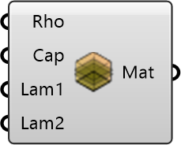

##  Soil Material

Define soil material properties for terrain layers. OutdoorPlus

#### Input
* ##### Rho 
Material density (rho) [kg/m³].
* ##### Cap 
Specific heat capacity (cap) [J/kgK].
* ##### Lam1 
First coefficient of thermal conductivity (lambda1) [W/mK]. Used in the formula: lambda = lambda1 + lambda2 * ws (where ws is moisture content).
* ##### Lam2 
Second coefficient of thermal conductivity (lambda2) [W/mK]. Used in the formula: lambda = lambda1 + lambda2 * ws (where ws is moisture content).

#### Output
* ##### Mat
Soil material settings for terrain layers.