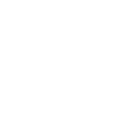

#  Surface Settings - [[source code]](https://github.com/Eddy3D-Dev/Eddy3D/search?q=%22Surface%20Settings%22)

Thermal + optical material properties for a building/ground MRT surface.

#### Input
* ##### Thick 
Material thickness (m).
* ##### k 
Thermal conductivity W/(m·K). Concrete ≈ 2.3.
* ##### rho 
Density kg/m³. Concrete ≈ 2400.
* ##### Cp 
Specific heat J/(kg·K).
* ##### eT 
Longwave emissivity 0–1.
* ##### aS 
Solar absorptance 0–1 (light ~0.3, dark ~0.9).
* ##### aV 
Visible absorptance 0–1.
* ##### RadMat 
Optional custom Radiance material string.

#### Output
* ##### Mat
Material for the MRT Surface component.