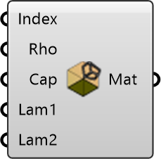

##  Terrain Surface Material

Select a terrain surface material from the list and override its properties. OutdoorPlus  Version 1.0.0.827

#### Input
* ##### Mat 
Select a material from the list.
* ##### Rho 
Material density (rho). Optional; default is 1980.
* ##### Cap 
Heat capacity (cap). Optional; default is 820.
* ##### Lam1 
Primary thermal conductivity (lambda1). Optional; default is 1.35.
* ##### Lam2 
Secondary thermal conductivity (lambda2). Optional; default is 0.0.

#### Output
* ##### Mat
Terrain surface material settings.