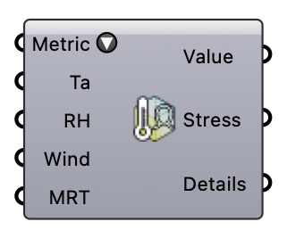

##  Thermal Comfort

Compute a thermal comfort metric at a point: UTCI (Ta, RH, wind, MRT), PET (adds the personal inputs), or NOAA Heat Index (Ta, RH only). Pick the metric from the dropdown — the inputs adapt. Wire hourly lists (e.g. EPW series) to compute annual values.  Version 1.0.0.827

#### Input
* ##### Metric 
Comfort metric to compute; the inputs adapt to the choice.
* ##### Ta 
Air temperature [°C].
* ##### RH 
Relative humidity [%].
* ##### Wind 
Wind speed at the subject [m/s].
* ##### MRT 
Mean radiant temperature [°C].

#### Output
* ##### Value
Metric value [°C].
* ##### Stress
Thermal stress category.
* ##### Details
Calculation details.