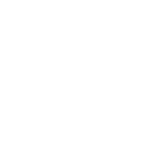

#  Translate Date To Hours - [[source code]](https://github.com/Eddy3D-Dev/Eddy3D/search?q=%22Translate%20Date%20To%20Hours%22)

Translate a Ladybug analysis period to hours of the year.

#### Input
* ##### Period 
Analysis period (Ladybug format), e.g. (2,2,2) and (11,11,11) for the second hour of February 2nd until the 11th hour of November 11th.

#### Output
* ##### Hours
1-based hours of the year inside the analysis period.