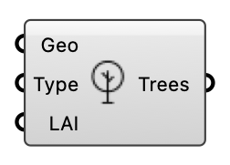

##  Tree

Represents a tree as a porous zone for wind blocking (Darcy-Forchheimer). Feed into the wind case component.

#### Input
* ##### Geo 
Tree/vegetation geometry (one per tree for correct sizing).
* ##### Type 
Tree density type: 'coarse', 'medium', or 'dense'. Or custom Darcy-Forchheimer B and A coefficient triples on two lines.
* ##### LAI 
Leaf Area Index. Typical: 2 (sparse) to 6 (dense). Alternative to Type.

#### Output
* ##### Trees
Tree porous-zone object; plug into the wind case Trees input.