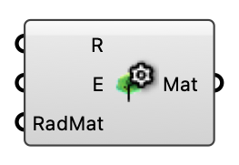

##  Tree Settings

Canopy material properties for an MRT tree surface.

#### Input
* ##### R 
Canopy shortwave reflectivity 0–1.
* ##### E 
Canopy longwave emissivity 0–1.
* ##### RadMat 
Optional custom Radiance material string for the tree canopy.

#### Output
* ##### Mat
Tree/canopy material for the MRT Surface component's Material input.