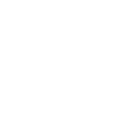

#  UTCI Weather - [[source code]](https://github.com/Eddy3D-Dev/Eddy3D/search?q=%22UTCI%20%28Weather%29%22)

Universal Thermal Climate Index from weather inputs. Connect an EPW (supplies wind, RH, ambient temp) and/or override Ambient Temp, RH, Wind, and MRT by hand. Item or list.

#### Input
* ##### EPW (W) 
Path to an EPW weather file (optional). When connected, supplies Wind, Relative Humidity, and Ambient Temperature for any of those left unconnected. Manual inputs override the EPW.
* ##### MRT (M) 
Mean radiant temperature (°C), as a single value or an hourly list. In EPW mode, MRT defaults to the ambient (dry-bulb) air temperature when not connected.
* ##### Ambient Temp (T) 
Ambient (dry-bulb) air temperature (°C), value or list. Overrides the EPW; required in manual mode (no EPW).
* ##### Relative Humidity (RH) 
Relative humidity (%), value or list. Overrides the EPW; required in manual mode.
* ##### Wind Speed (V) 
Wind speed at the 10 m UTCI reference height (m/s), value or list. Overrides the EPW; required in manual mode.

#### Output
* ##### UTCI (U)
Universal Thermal Climate Index (°C equivalent).
* ##### Stress (S)
Thermal-stress category: 0 = no stress, negative = cold stress, positive = heat stress.
* ##### Category (C)
Thermal-stress category name.
* ##### Comfort Hours (H)
No-thermal-stress hours (UTCI category 0). Emitted only when a full 8760-hour series is given.
* ##### Comfort % (%)
Percentage of comfortable hours over the year. Emitted only when a full 8760-hour series is given.