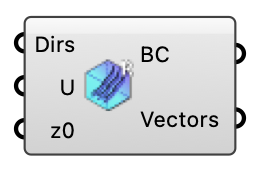

#  Uniform Flow - [[source code]](https://github.com/Eddy3D-Dev/Eddy3D/search?q=%22Uniform%20Flow%22)

Create a uniform (constant velocity) inflow boundary condition for Eddy3D.

#### Input
* ##### Dirs 
Wind directions as meteorological degrees (wind-from, clockwise from north) or flow vectors. One solver case is created per direction. Optional; default is flow toward +X.
* ##### Wind Speed (U) 
Uniform inflow speed (m/s), one value per wind direction. A single value applies to all directions; a shorter list repeats its last value. Optional; default is 5.
* ##### z0 
Aerodynamic roughness length (m), recorded for roughness-aware turbulence wall functions. Does not change the uniform inlet velocity. Optional; default is 1.

#### Output
* ##### Boundary Conditions (BC)
Uniform inflow boundary conditions (including the wind directions); plug into the wind case BC input.
* ##### Vectors
Resolved unit flow vectors, one per wind direction.