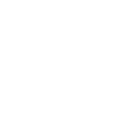

#  Vegetation Mesh Settings - [[source code]](https://github.com/Eddy3D-Dev/Eddy3D/search?q=%22Vegetation%20Mesh%20Settings%22)

Configure mesh refinement for vegetation regions. OutdoorPlus

#### Input
* ##### Feature Refinement (FR) 
Feature refinement level. Optional; default is 2.
* ##### MnSR 
Minimum refinement on surfaces. Optional; default is 4.
* ##### MxSR 
Maximum refinement on surfaces. Optional; default is 5.

#### Output
* ##### Mesh
Mesh refinement settings for vegetation regions.