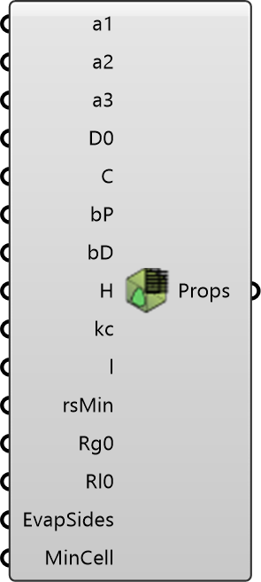

##  Vegetation Properties

Define vegetation property coefficients for canopy modeling. OutdoorPlus

#### Input
* ##### Cd 
Vegetation drag coefficient (Cd). Used in momentum sink and turbulence model.
* ##### C 
Proportionality factor for aerodynamic resistance calculation.
* ##### l 
Characteristic leaf length (l) for aerodynamic resistance.
* ##### rsMin 
Minimum stomatal resistance (rsMin).
* ##### EvapSides 
Number of evaporation sides for transpiration calculation.
* ##### kc 
Radiation extinction coefficient (kc).

#### Output
* ##### Props
Vegetation properties as a Setting instance.