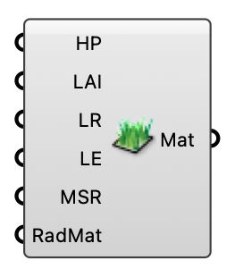

##  Vegetation Settings

Leaf/canopy material properties for an MRT vegetation surface.

#### Input
* ##### HP 
Height of plants (m).
* ##### LAI 
Leaf area index (dimensionless).
* ##### LR 
Leaf reflectivity 0–1.
* ##### LE 
Leaf emissivity 0–1.
* ##### MSR 
Minimum stomatal resistance (s/m).
* ##### RadMat 
Optional custom Radiance material string.

#### Output
* ##### Mat
Vegetation material for the MRT Surface component's Material input.