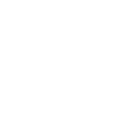

##  [[source code]](https://github.com/Eddy3D-Dev/Eddy3D/search?q=%22Vegetation%20Settings%22)

Leaf/canopy material properties for an MRT vegetation surface.

#### Input
* ##### Height Plants (HP) 
Height of plants (m).
* ##### LAI 
Leaf area index (dimensionless).
* ##### LeafReflectivity (LR) 
Leaf reflectivity 0–1.
* ##### LeafEmissivity (LE) 
Leaf emissivity 0–1.
* ##### MSR 
Minimum stomatal resistance (s/m).
* ##### RadMat 
Optional custom Radiance material string.

#### Output
* ##### Mat
Vegetation material for the MRT Surface component's Material input.