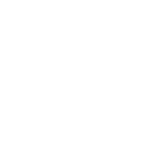

##  [[source code]](https://github.com/Eddy3D-Dev/Eddy3D/search?q=%22Viral%20Emitter%22)

An airborne-pathogen passive-scalar source box for an indoor ventilation case.

#### Input
* ##### Zone (Z) 
Box zone occupied by the viral source.
* ##### Injection Rate (IR) 
Viral tracer injection rate (specific).

#### Output
* ##### Source (S)
Viral source for the Indoor Case component.