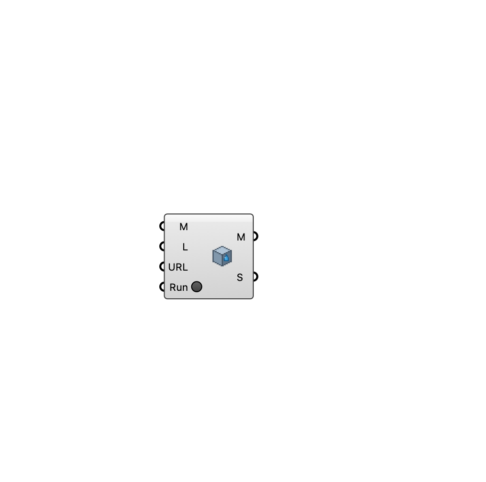

#  [[source code]](https://github.com/Eddy3D-Dev/Eddy3D/search?q=%22Watertight%22)

Combine a multi-part building mesh into a single watertight, CFD-ready solid via the bundled Python mesh service (trimesh/manifold3d/pymeshfix). The server auto-starts locally on the first run (uv-managed Python environment; first start installs it, 1-2 minutes) and is reused afterwards.

#### Input
* ##### Mesh (M) 
Input meshes (merged and combined into one solid).
* ##### Min Length (L) 
Vertex weld tolerance in model units. Two vertices closer than this are merged. Default 0.1 (10 cm for meter-unit models).
* ##### URL 
MetaBlock API base URL.
* ##### Run 
Process the mesh — auto-starts the local server on first run. Resets when the result arrives.

#### Output
* ##### Combined (M)
Combined watertight CFD-ready solid mesh.
* ##### Status (S)
Status message.