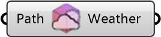

##  Weather

Read an EPW file and create a Weather object for the simulation. OutdoorPlus  Version 1.0.0.827

#### Input
* ##### Path 
Full path to the EPW weather file.

#### Output
* ##### Weather
Weather object containing EPW data.