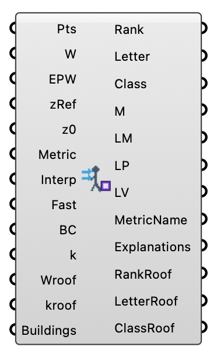

#  Wind Comfort Predictor (ML) - [[source code]](https://github.com/Eddy3D-Dev/Eddy3D/search?q=%22Wind%20Comfort%20Predictor%20%28ML%29%22)

Calculate Pedestrian Wind Comfort using predicted wind fields from the ONNX model.

#### Input
* ##### Pts 
Analysis points for mesh visualization.
* ##### Wind Speeds (W) 
Predicted wind speeds (m/s) as a DataTree from WindPredictor.
* ##### EPW 
Path to the .epw weather file.
* ##### zRef 
Reference height for the simulations (m). Default = 10.0
* ##### z0 
Roughness length (m). Default = 1.0
* ##### Metric 
Comfort metric to use.
* ##### Interp 
Interpolate between wind directions. Default = true
* ##### Fast 
Use Method of Moments for ultra-fast Weibull estimation. Default = true
* ##### Boundary Conditions (BC) 
Optional simulation metadata to automate zRef, z0, and Uref (sim).
* ##### k 
Turbulent kinetic energy (m²/s²) as a DataTree from WindPredictor. When provided, GEM (Gust Equivalent Mean) is used: GEM = U + g × √(2k/3). Peak factor g is auto-set per metric.
* ##### Wroof 
Optional roof-level wind speeds (m/s) DataTree.
* ##### kroof 
Optional roof-level TKE (m²/s²) DataTree.
* ##### Buildings 
Optional list of Brep or Mesh objects representing buildings. Needed to elevate roof-level comfort meshes to correct heights.

#### Output
* ##### Rank
Wind comfort rank (integer).
* ##### Letter
Wind comfort class letter (e.g., A, B, C).
* ##### Class
Wind comfort class description.
* ##### Comfort Mesh (M)
Colored mesh representing comfort levels.
* ##### Legend Mesh (LM)
Legend mesh for comfort categories.
* ##### Legend Points (LP)
Label points for the legend letters.
* ##### Legend Letters (LV)
Letters (A-S) for the legend.
* ##### MetricName
The name of the currently active comfort/safety standard.
* ##### Explanations
Detailed descriptions for each class (e.g., A: Sitting Long).
* ##### RankRoof
Wind comfort rank (integer) for roof level.
* ##### LetterRoof
Wind comfort class letter for roof level.
* ##### ClassRoof
Wind comfort class description for roof level.