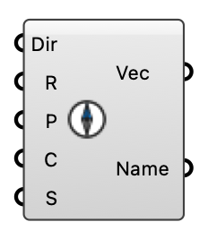

##  Wind Compass

Visualize a wind direction on a compass circle. Direction is meteorological degrees (0=N, 90=E, 180=S, 270=W); outputs the flow vector and the 16-point cardinal name.

#### Input
* ##### Dir 
Wind direction in degrees (0=N, 90=E, 180=S, 270=W).
* ##### R 
Radius of the compass circle.
* ##### P 
Center of the compass.
* ##### C 
Display color.
* ##### S 
Scale of the directional arrow.

#### Output
* ##### Vec
Wind direction (flow) vector.
* ##### Name
16-point cardinal name (e.g. NNE).